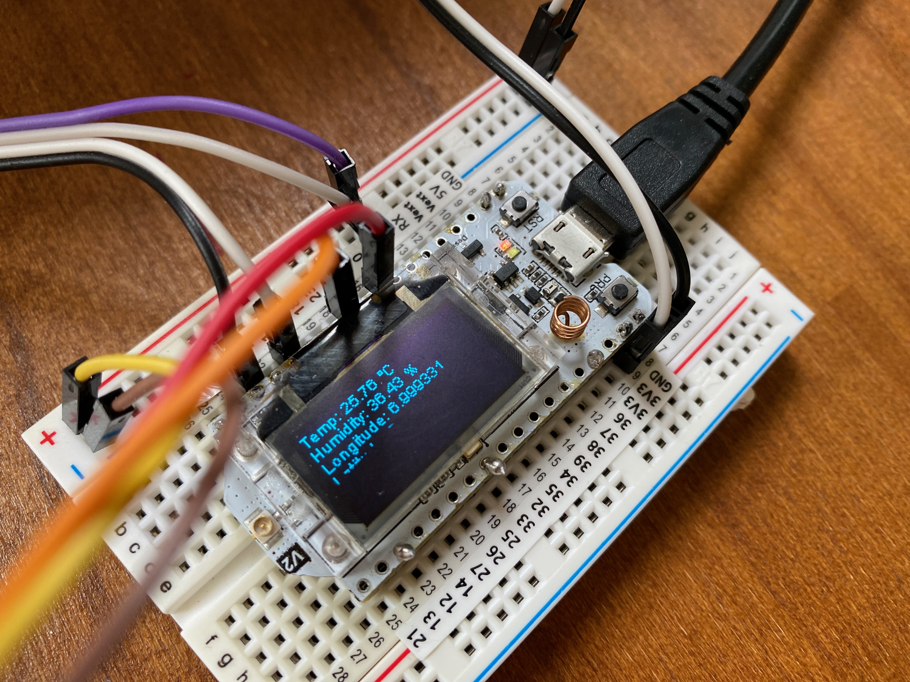
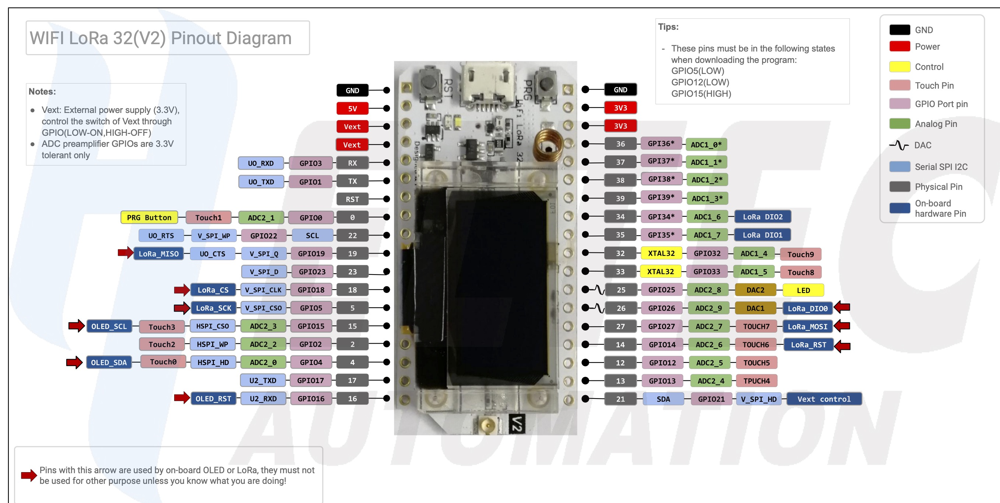

# Camper-tracker
GPS and temperature tracker for camper (or car) tracking.

## Features
- Display Sensor Data on OLED Screen
- Send data continously to Server via HTTP POST
- Send data via LORA to TTN

## Hardware
- Heltec Wifi32 Lora V2 Board with OLED Display
- Temperatur sensor: BME280
- GPS: NEO 6M

## Wiring
- BME280 -> 4, 15
- NEO 6M -> 22, 23

## Setup

## Pinout Diagram

